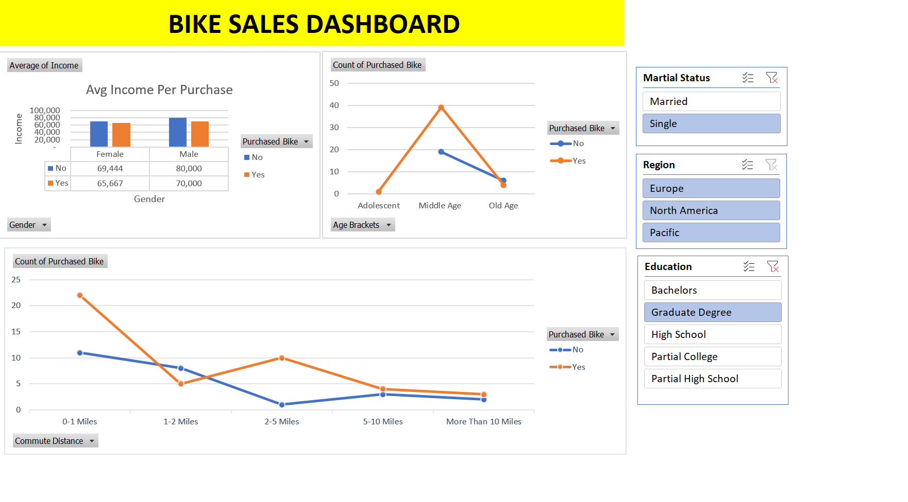

# Bike Sales Data Analysis Project
This project involves analyzing a dataset related to bike purchases using Excel tools like Pivot Tables, data cleaning techniques, and interactive dashboards. The goal is to extract meaningful insights about customer behavior, such as income distribution, age range analysis, and commute distance patterns, and visually represent these findings.

   

## Tags
`Excel` `data-analysis` `SQL` `data-cleaning` `pivot-table` `XLOOKUP` `data-modification` `data-formatting`

## Project Steps

### Step 1: Working Sheet Creation
To ensure that the original dataset remains unchanged, we created a **Working Sheet** to perform data transformations and analysis. This safeguards the raw data in case of any errors during manipulation.

### Step 2: Data Cleaning
- **Duplicate Removal**: We removed rows with duplicate values to clean up unnecessary and repetitive data using Excel's `Remove Duplicates` feature.
- **Data Format Adjustments**: The **Income** column was formatted as a number without currency symbols for consistency in analysis.
- **Validation of Columns**: Columns such as **Education** and **Children** were checked for spelling mistakes or formatting issues to ensure data consistency.

### Step 3: Age Brackets
Since the age data was dense, we categorized it into meaningful brackets:
- Adolescent (less than 31)
- Middle Age (31–54)
- Old Age (55+)

This was achieved using nested `IF` statements in Excel.

### Step 4: Pivot Table Creation
We created multiple Pivot Tables to summarize and visualize the data. Pivot Tables help summarize large datasets efficiently:
- **Average Income by Gender**: We examined the average income of customers by gender and their bike purchase status.
- **Commute Distance and Bike Purchases**: We analyzed how commute distance (e.g., 0-1 miles, 2-5 miles) impacts bike purchasing decisions.
- **Age Brackets and Bike Purchases**: A summary of bike purchases across different age groups.

### Step 5: Data Visualization
We used Pivot Tables to create various visualizations, including bar charts and line graphs, to provide insights into:
- **Average Income by Gender**: Visualized as a bar chart showing income differences between males and females who purchased bikes.
- **Commute Distance Analysis**: A line chart to represent bike purchases based on how far individuals commute.

### Step 6: Dashboard Creation
We consolidated all the visualizations into a **Dashboard** for an easy-to-read summary:
- Added slicers for quick filtering on parameters such as **Marital Status**, **Region**, and **Education**.
- Applied slicers to multiple graphs for better user interactivity.

### Step 7: Dashboard Interaction
We enabled slicers to filter data by attributes such as **Region**, **Marital Status**, and **Education**. This allows users to dynamically adjust the data and view specific subsets of the data visually.

## How It Relates to Data Analysis
This project highlights important data analysis techniques, including:
1. **Data Cleaning**: Ensuring data quality by removing duplicates and standardizing formats.
2. **Data Transformation**: Categorizing age data and adjusting formats for better analysis.
3. **Pivot Tables**: Used to summarize large datasets, essential for performing exploratory data analysis (EDA).
4. **Data Visualization**: Creating clear visual representations like bar charts and line graphs to identify trends and insights.
5. **Dashboarding**: Designing an interactive dashboard that allows users to filter and drill down into specific subsets of the dataset, enhancing decision-making capabilities.

## Conclusion
This project demonstrates how raw data can be transformed, cleaned, and visualized to produce actionable business insights. By using Excel’s tools such as Pivot Tables, data visualization, and dashboards, we extracted valuable information from the dataset related to bike sales, customer demographics, and behavior patterns.
